<h1> Report on Clustering Algorithms</h1>
- With implementation of KMeans, KMeans++ and Spectral Clustering <br>
- Submitted by: Deepak Singh

## Contents

- [Introduction](#1)
- [Standard algorithm (naive k-Means) implementation](#2)
    - Explanation
    - Testing on 1-D sample
    - Testing on 2-D sample
    - Comparing with SKlearn versino of KMeans
- [K-Means++ implementation with Centroid Initialization](#3)
    - Explanation
    - Testing on Cancer Dataset
- [Choosing k in KMeans Clustering](#4)
    - The Elbow Method
    - The Silhouette Method
    - Calculating within centroid SSE
    - Calculating Silhouette score
- [Potential issues with KMeans Clustering](#5)
    - Comparing my implementation of KMEans Clustering on various shapes of data
- [Spectral Clustering Implementation](#6)
    - Explanation
    - Testing on moon shaped data
    - Testing on concentric circles shaped data
- [How to measure performance](#7)
    - Time Complexity
    - Speed Test Benchmarking - (My implementation, i.e. DS_KMeans vs Sklearn KMeans)
    - Rand Index
    - Mutual Information Score
    - Homogeneity, completeness and V-measure (Ref: scikit-learn)
- [Reference](#8)
    - Initialization code
    - References used from the internet
    - Functions implemented
    - Packages used in implementation
- [Code Base](#9)
<a id='1'></a>

***

## 1) Introduction

### Clustering is one of the most widely used techniques for exploratory data analysis.
- It has applications ranging from statistics, computer science, biology to social sciences or psychology.

#### Clustering is the process of grouping similar objects into groups that are distinctly identifiable from one another

Besides machine learning, it is a well known technique in pattern recognition, information retrieval, bioinformatics, data compression, and image analysis

There are a number of use cases of clustering in real world business scenarios. Some of the common applications are listed below:
- pattern recognition
- customer segmentation
- search engine results grouping
- medical imaging
- image segmentation and compression
- anomaly detection

Common idea of clustering can be visualized as groups with small distances between various cluster members, as shown below:

<div style="border-radius:10px; border : #682F2F solid; background-color:white; font-size:110%; padding-left:10px; text-align:left">
<h5> Clustering</h5>
 <br>
source: https://en.wikipedia.org/wiki/File:Cluster-2.svg

#### Although there are several algorithms available that can solve for a clustering analysis problem, that differ considerably in their ability, complexity and efficiency of finding different clusters in a given dataset, we will begin our focus on k-means clustering as one of the most important one.

Some of the common clustering algorithms as mentioned on scikit-learn (https://scikit-learn.org/stable/modules/clustering.html) are:
<table border="1" class="dataframedataframe">  <thead>    <tr style="text-align: left;">      <th>Method name</th>      <th>Parameters</th>      <th>Scalability</th>      <th>Usecase</th>      <th>Geometry (metric used)</th>    </tr>  </thead>  <tbody>    <tr>      <td>K-Means</td>      <td>number of clusters</td>      <td>Very large n_samples, medium n_clusters with MiniBatch code</td>      <td>General-purpose, even cluster size, flat geometry, not too many clusters, inductive</td>      <td>Distances between points</td>    </tr>    <tr>      <td>Affinity propagation</td>      <td>damping, sample preference</td>      <td>Not scalable with n_samples</td>      <td>Many clusters, uneven cluster size, non-flat geometry, inductive</td>      <td>Graph distance (e.g. nearest-neighbor graph)</td>    </tr>    <tr>      <td>Mean-shift</td>      <td>bandwidth</td>      <td>Not scalable with n_samples</td>      <td>Many clusters, uneven cluster size, non-flat geometry, inductive</td>      <td>Distances between points</td>    </tr>    <tr>      <td>Spectral clustering</td>      <td>number of clusters</td>      <td>Medium n_samples, small n_clusters</td>      <td>Few clusters, even cluster size, non-flat geometry, transductive</td>      <td>Graph distance (e.g. nearest-neighbor graph)</td>    </tr>    <tr>      <td>Ward hierarchical clustering</td>      <td>number of clusters or distance threshold</td>      <td>Large n_samples and n_clusters</td>      <td>Many clusters, possibly connectivity constraints, transductive</td>      <td>Distances between points</td>    </tr>    <tr>      <td>Agglomerative clustering</td>      <td>number of clusters or distance threshold, linkage type, distance</td>      <td>Large n_samples and n_clusters</td>      <td>Many clusters, possibly connectivity constraints, non Euclidean distances, transductive</td>      <td>Any pairwise distance</td>    </tr>    <tr>      <td>DBSCAN</td>      <td>neighborhood size</td>      <td>Very large n_samples, medium n_clusters</td>      <td>Non-flat geometry, uneven cluster sizes, outlier removal, transductive</td>      <td>Distances between nearest points</td>    </tr>    <tr>      <td>OPTICS</td>      <td>minimum cluster membership</td>      <td>Very large n_samples, large n_clusters</td>      <td>Non-flat geometry, uneven cluster sizes, variable cluster density, outlier removal, transductive</td>      <td>Distances between points</td>    </tr>    <tr>      <td>Gaussian mixtures</td>      <td>many</td>      <td>Not scalable</td>      <td>Flat geometry, good for density estimation, inductive</td>      <td>Mahalanobis distances to centers</td>    </tr>    <tr>      <td>BIRCH</td>      <td>branching factor, threshold, optional global clusterer.</td>      <td>Large n_clusters and n_samples</td>      <td>Large dataset, outlier removal, data reduction, inductive</td>      <td>Euclidean distance between points</td>    </tr>    <tr>      <td>Bisecting K-Means</td>      <td>number of clusters</td>      <td>Very large n_samples, medium n_clusters</td>      <td>General-purpose, even cluster size, flat geometry, no empty clusters, inductive, hierarchical</td>      <td>Distances between points</td>    </tr>  </tbody></table>

We begin our journey by implementing a simple KMeans algorithm
<a id='2'></a>

***

## 2) Standard algorithm (naive k-Means) implementation

 <br>

Here is a simple implementation of kmeans algorithm, which has been sourced from the algorithm provided in repo at: https://github.com/parrt/msds689/blob/master/projects/kmeans/kmeans.md

For easy reference, all the KMeans algorithms discussed here as well as several helper funcitons have been coded into a separate py file: `ds_kmeans.py`

<div style="border-radius:10px; border : #682F2F solid; background-color:white; font-size:110%; padding-left:10px; text-align:left">
<h5> KMeans Clustering visualization</h5>

 <br>
source: https://mdetiberiis.medium.com/clustering-8df9aa13c00b

#### Explanation:
- The most common KMeans algorithm uses an iterative refinement technique
- Due to its ubiquity, it is often called "the k-means algorithm"; it is also referred to as Lloyd's algorithm, particularly in the computer science community. It is sometimes also referred to as "naïve k-means", because there exist much faster alternatives.

Steps
- The first step in k-means is to pick the number of clusters, k
- Randomly select the centroid for each cluster. How? If want to have 3 clusters, so k = 3 here. We then randomly select the initial centroids
- Once we have the initial centroids, we assign each of the points in our dataset to the closest possible centroid
- We then calculate the centroi of the new assigned points in each cluster and shift the cluster centroids accordingly
- The above two steps are repeated till one of the conditions are met (such as number of iterations limit reached or there is no significant change in the new centrois after each iteration)

### Testing on 1-D sample


```python
X = np.linspace(80, 100, 46)
cent, labels = DS_KMeans(X = X, k = 3)
create_plot(X, labels, size = (10,1))
```


    
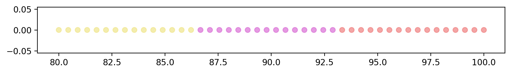
    


### Testing on 2-D sample


```python
X = datasets.load_iris().data[:,[0,1]]
cent, labels = DS_KMeans(X = X, k = 3, random_state = 47, max_iter=50)
create_plot(X, labels, size = (6,4))
```


    
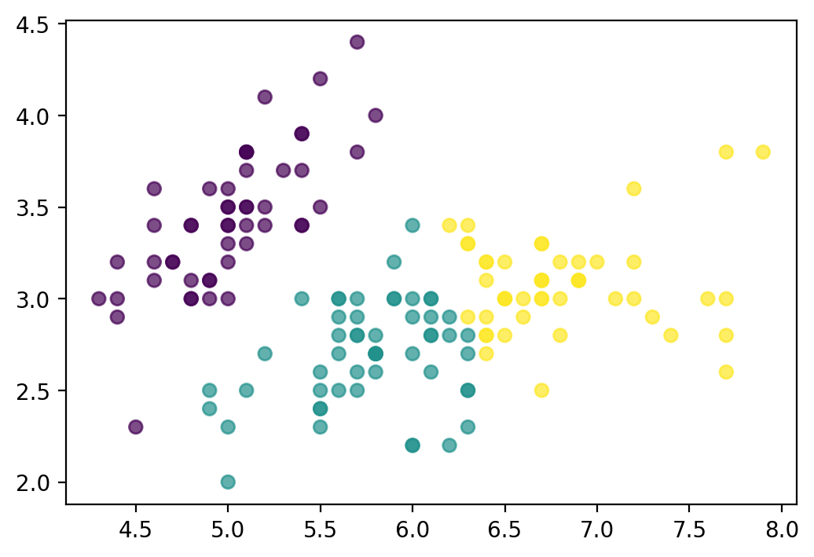
    


### Comparing with sklearn version of KMeans:


```python
X = datasets.load_iris().data[:,[0,1]]
kmeans = KMeans(n_clusters=3, random_state = 47, max_iter=50, n_init = 'auto').fit(X)
labels, centroids = kmeans.predict(X), kmeans.cluster_centers_
create_plot(X, labels, size = (6,4))
```


    
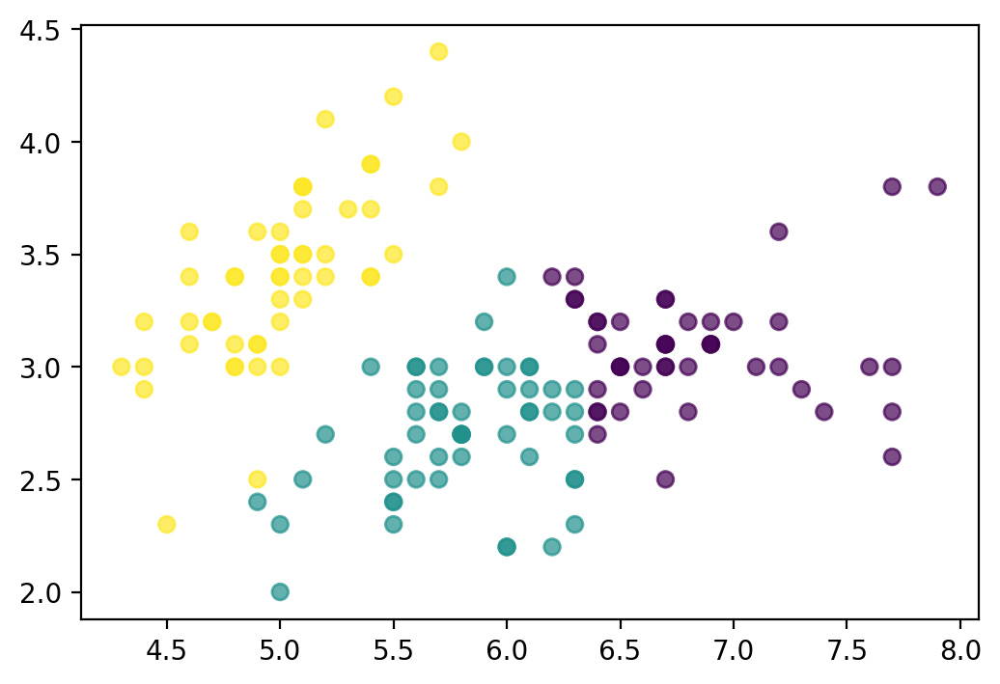
    


Note: it is worthwhile to note that the clusters in our `DS_KMeans` are somewhat different from what sklearn `KMeans` displays here

- This could be due to the fact that our initiated centroids are not far enough from each other
- We're going to update our function in order to get a better version of the clusters
<a id='3'></a>

***

## 3) K-Means++ implementation with Centroid Initialization

<div style="border-radius:10px; border : #682F2F solid; background-color:white; font-size:110%; padding-left:10px; text-align:left">
<h5> KMeans Clustering visualization</h5>

 <br>
source: https://www.linkedin.com/pulse/k-means-clustering-its-real-use-case-surayya-shaikh/

Recall that we just imlemented a version of KMeans algorithm where the initial centroids are randomly selected.
In this updated version (`K-means++`), we initialize the centroids as follows:
- Out of k centroids, initial centroid is selected at random, call it part of a set of centroids which will keep on updating
- Calculate the distance of all points from the set of centroids
- The next centroid is the farthest point from the existing set of centroids
- Above step is repeated till we get the desired number of initial centroids


```python
X = datasets.load_iris().data[:,[0,1]]
cent, labels = DS_KMeans(X = X, k = 3, init = 'k-means++', random_state = 47, max_iter=50)

# plotting 
create_plot(X, labels, size = (6,4), title = 'Iris Dataset')
```


    
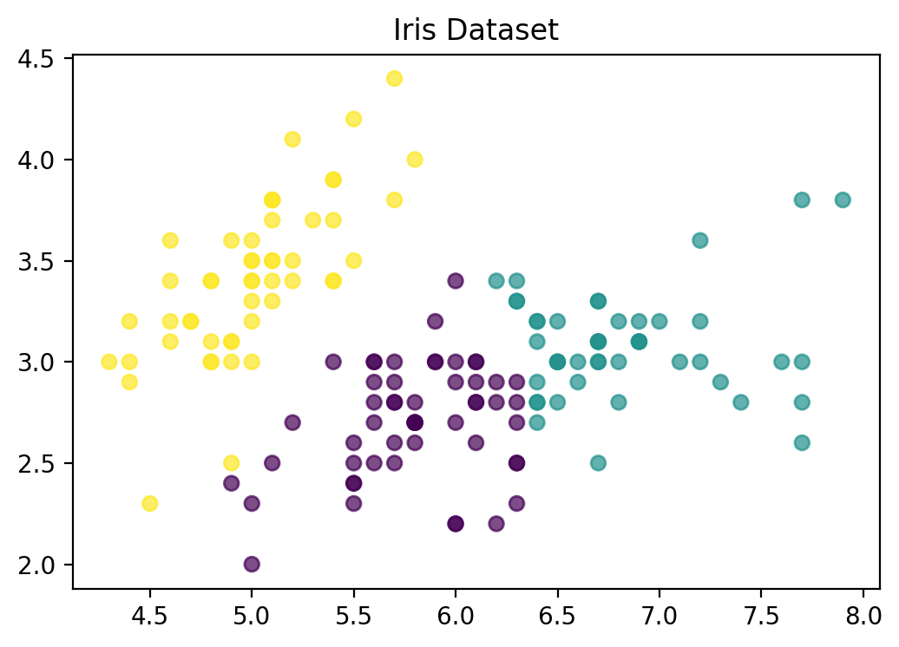
    


- Another possible use case that KMeans algorithm is utilized for is for Classification

#### Testing on Cancer Dataset


```python
cancer = datasets.load_breast_cancer()
X = cancer.data
y = cancer.target
sc = StandardScaler()
sc.fit_transform(X)
cent, labels = DS_KMeans(X=X, k=2, random_state = 47, max_iter=50)

create_plot(X, labels, size = (6,4), title = 'Cancer Classification')
```


    
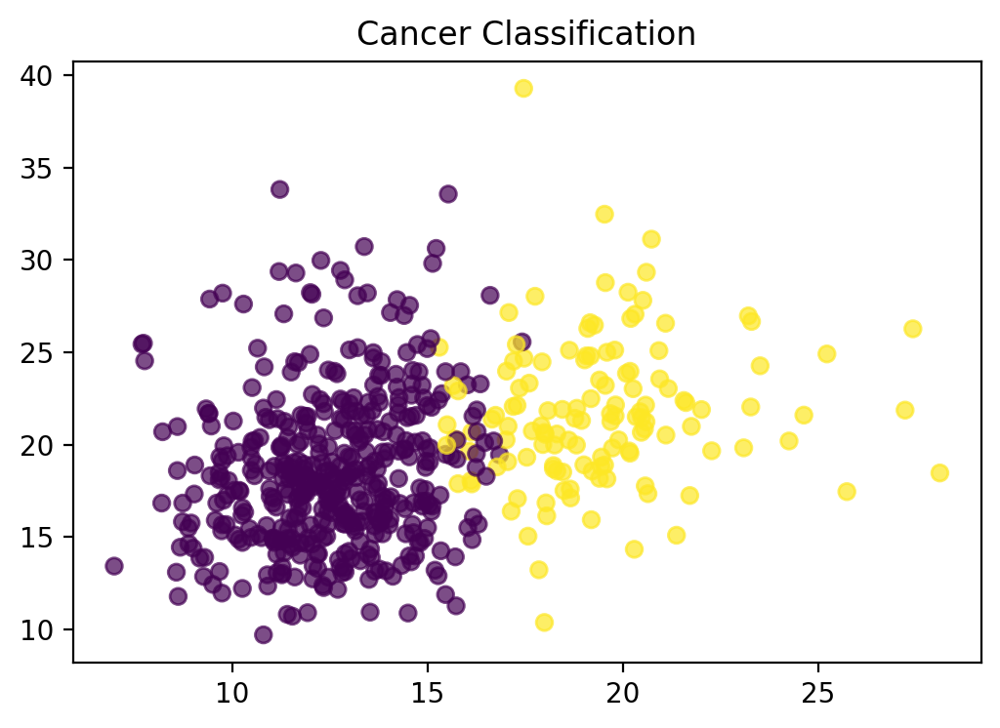
    


We will now discuss how to select the number of clusters
<a id='4'></a>

***

## 4) Choosing k in KMeans Clustering
There are two key methods that are helpful in choosing the number of clusters while performing clustering of unknown dataset:

- The Elbow Method
- The Silhouette Method

Let's understand each of these methods in detail using an example below:


```python
X, y = make_blobs(n_samples = 1000, centers = 3, n_features=2, shuffle=True, random_state=47)
create_plot(X, y, size = (6, 4), title = 'Gaussian blobs')
```


    

    


### 1) Elbow method (using Within Cluster SSE)
- Calculate within cluster sum-of-squared-errors (WSSE) for various values of k
- Choose k when the WSSE stops to diminish significantly


```python
calculate_WSS(X, kmax = 10, size = (5, 3))
```


    
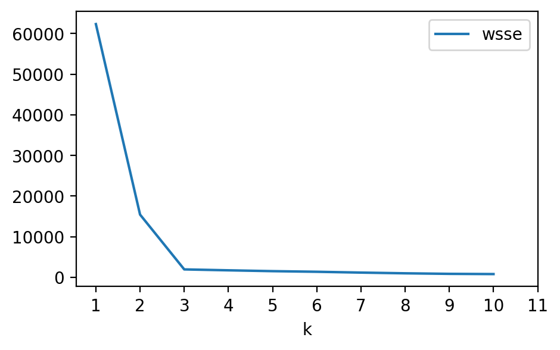
    


<div>
<style scoped>
    .dataframe tbody tr th:only-of-type {
        vertical-align: middle;
    }

    .dataframe tbody tr th {
        vertical-align: top;
    }

    .dataframe thead th {
        text-align: right;
    }
</style>
<table border="1" class="dataframe">
  <thead>
    <tr style="text-align: right;">
      <th></th>
      <th>k</th>
      <th>wsse</th>
    </tr>
  </thead>
  <tbody>
    <tr>
      <th>0</th>
      <td>1</td>
      <td>62329.403201</td>
    </tr>
    <tr>
      <th>1</th>
      <td>2</td>
      <td>15433.692022</td>
    </tr>
    <tr>
      <th>2</th>
      <td>3</td>
      <td>1941.586020</td>
    </tr>
    <tr>
      <th>3</th>
      <td>4</td>
      <td>1716.093623</td>
    </tr>
    <tr>
      <th>4</th>
      <td>5</td>
      <td>1510.409226</td>
    </tr>
    <tr>
      <th>5</th>
      <td>6</td>
      <td>1357.657753</td>
    </tr>
    <tr>
      <th>6</th>
      <td>7</td>
      <td>1156.201398</td>
    </tr>
    <tr>
      <th>7</th>
      <td>8</td>
      <td>979.395929</td>
    </tr>
    <tr>
      <th>8</th>
      <td>9</td>
      <td>845.898392</td>
    </tr>
    <tr>
      <th>9</th>
      <td>10</td>
      <td>790.757192</td>
    </tr>
  </tbody>
</table>
</div>


### 2) Silhouette Method
- As per wikipedia, the silhouette value measures how similar a point is to its own cluster (cohesion) compared to other clusters (separation)
- The Silhouette Value s(i) for each data point i is defined as follows:

$s(i)  = \frac{b(i) - a(i)}{max{a(i), b(i)}}$ if $|C| > 1$ <br>
$s(i) = 0$ if $|C| = 1$
- where
    - a(i) is the measure of similarity of the point i to its own cluster, and
    - b(i) is the measure of dissimilarity of the point i from points in other clusters
- A simple implementation is demonstrated below


```python
calculate_sil(X, kmax = 10, size = (5, 3))
```


    
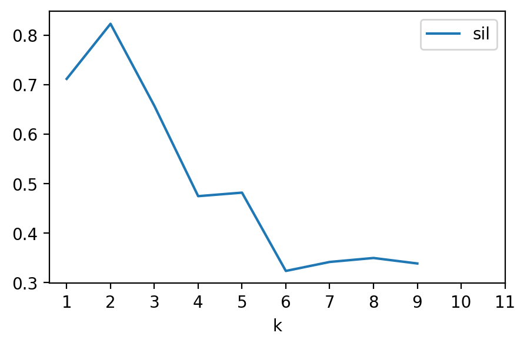
    


<div>
<style scoped>
    .dataframe tbody tr th:only-of-type {
        vertical-align: middle;
    }

    .dataframe tbody tr th {
        vertical-align: top;
    }

    .dataframe thead th {
        text-align: right;
    }
</style>
<table border="1" class="dataframe">
  <thead>
    <tr style="text-align: right;">
      <th></th>
      <th>k</th>
      <th>sil</th>
    </tr>
  </thead>
  <tbody>
    <tr>
      <th>0</th>
      <td>2</td>
      <td>0.711762</td>
    </tr>
    <tr>
      <th>1</th>
      <td>3</td>
      <td>0.823127</td>
    </tr>
    <tr>
      <th>2</th>
      <td>4</td>
      <td>0.657284</td>
    </tr>
    <tr>
      <th>3</th>
      <td>5</td>
      <td>0.474546</td>
    </tr>
    <tr>
      <th>4</th>
      <td>6</td>
      <td>0.481669</td>
    </tr>
    <tr>
      <th>5</th>
      <td>7</td>
      <td>0.323311</td>
    </tr>
    <tr>
      <th>6</th>
      <td>8</td>
      <td>0.341483</td>
    </tr>
    <tr>
      <th>7</th>
      <td>9</td>
      <td>0.349514</td>
    </tr>
    <tr>
      <th>8</th>
      <td>10</td>
      <td>0.338387</td>
    </tr>
  </tbody>
</table>
</div>


***
<a id='5'></a>

## 5) Potential issues with KMeans Clustering
- What if the data is not visibly identifiable into different clusters?
- Some of the data might be clustered diferently, say concentric circlessay concentric circles
- In KMeans clustering, inertia (within centroid sum of quares) makes the assumption that clusters are convex and isotropic

#### Comparison of my implementation of KMeans (DS_KMeans) for various shapes of clusters


```python
X, X_aniso, X_varied, X_filtered, X_c, X_m = gen_data()
fig,ax = plt.subplots(nrows=2, ncols=3, figsize=(15, 8))
for i,v1 in enumerate([[X_c, X, X_aniso], [X_varied, X_filtered, X_m]]):
    for j, v2 in enumerate(v1):
        cent, labs = DS_KMeans(v2, 3, random_state = 47, max_iter=50)
        ax[i][j].scatter(v2[:, 0], v2[:, 1], c = labs, cmap = mpl.colormaps['viridis'], alpha = 0.7)
        ax[i][j].set_title([['Concentric Circles', 'Gaussian Blobs', 'Anisotropic'], ['Varied', 'Filtered', 'Moons']][i][j])
plt.show()
```


    
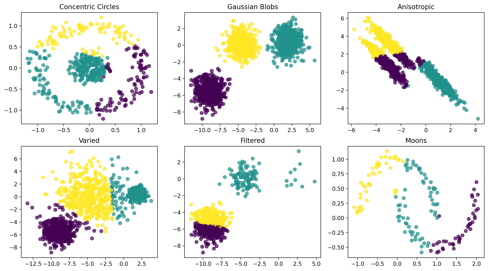
    


***
<a id='6'></a>

## 6) Spectral Clustering Implementation

#### As shown in the charts above, simple KMeans algorithm doesn't result in accurate clusters for all types of datasets
#### Hence there's need for a more robust algorithm, such as Spectral Clustering

- Spectral clustering techniques make use of the spectrum (eigenvalues) of the similarity matrix of the data to perform dimensionality reduction before clustering in fewer dimensions. The similarity matrix is provided as an input and consists of a quantitative assessment of the relative similarity of each pair of points in the datase

- Knowing the n-by-k matrix V of selected eigenvectors, mapping — called spectral embedding — of the original n data points is performed to a k-dimensional vector space using the rows of V. Now the analysis is reduced to clustering vectors with k components, which may be done in various ways.

- In the simplest case k=1, the selected single eigenvector v, called the Fiedler vector, corresponds to the second smallest eigenvalue. Using the components of v, one can place all points whose component in v is positive in the set +${\displaystyle B_{+}}$ and the rest in −${\displaystyle B_{-}}$, thus bi-partitioning the graph and labeling the data points with two labels. This sign-based approach follows the intuitive explanation of spectral clustering via the mass-spring model — in the low frequency vibration mode that the Fiedler vector v represents, one cluster data points identified with mutually strongly connected masses would move together in one direction, while in the complement cluster data points identified with remaining masses would move together in the opposite direction. The algorithm can be used for hierarchical clustering by repeatedly partitioning the subsets in the same fashion.

- In the general case of k>1, any vector clustering technique can be used, e.g., DBSCAN.
- Reference:
    - https://en.wikipedia.org/wiki/Spectral_clustering
    - https://people.csail.mit.edu/dsontag/courses/ml14/notes/Luxburg07_tutorial_spectral_clustering.pdf

#### k-nearest neighbor graphs: 
- Here the goal is to connect vertex vi with vertex vj if vj is among the k-nearest neighbors of vi. 
- However, this definition leads to a directed graph, as the neighborhood relationship is not symmetric. 
- There are two ways of making this graph undirected. The first way is to simply ignore the directions of the edges, that is we connect vi and vj with an undirected edge if vi is among the k-nearest neighbors of vj or if vj is among the k-nearest neighbors of vi. 
- The resulting graph is what is usually called the k-nearest neighbor graph. The second choice is to connect vertices vi and vj if both vi is among the k-nearest neighbors of vj and vj is among the k-nearest neighbors of vi. 
- The resulting graph is called the mutual k-nearest neighbor graph. In both cases, after connecting the appropriate vertices we weight the edges by the similarity of their endpoints.

<div style="border-radius:10px; border : #682F2F solid; background-color:white; font-size:110%; padding-left:10px; text-align:left">
<h5> Spectral Clustering - k-nearest neighbor graphs</h5>

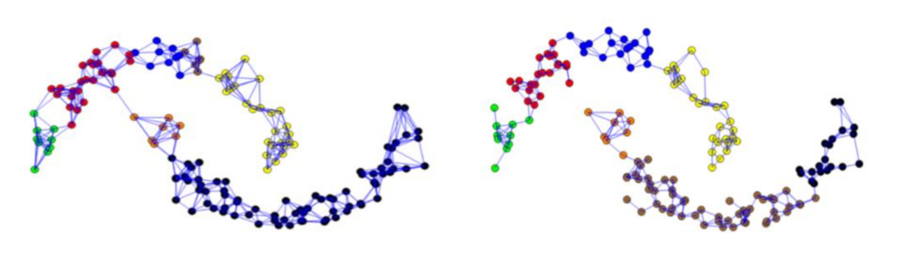 <br>

#### Spectral Clustering Matrix Representation
Adjacency and Affinity Matrix (A)

The graph (or set of data points) can be represented as an Adjacency Matrix, where the row and column indices represent the nodes, and the entries represent the absence or presence of an edge between the nodes (i.e. if the entry in row 0 and column 1 is 1, it would indicate that node 0 is connected to node 1).

An Affinity Matrix is like an Adjacency Matrix, except the value for a pair of points expresses how similar those points are to each other. If pairs of points are very dissimilar then the affinity should be 0. If the points are identical, then the affinity might be 1. In this way, the affinity acts like the weights for the edges on our graph.

<div style="border-radius:10px; border : #682F2F solid; background-color:white; font-size:110%; padding-left:10px; text-align:left">
<h5> Spectral Clustering - Adjacency and Affinity Matrix (A)</h5>

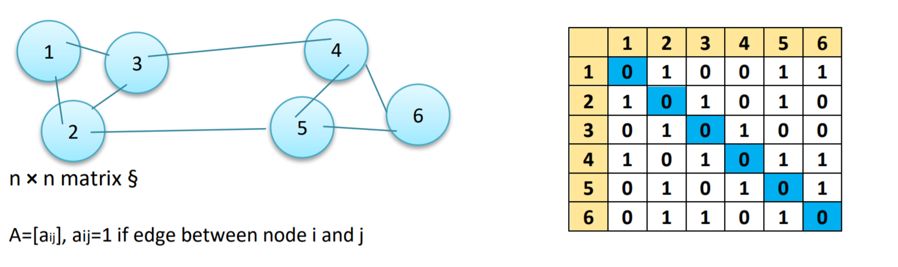 <br>

<div style="border-radius:10px; border : #682F2F solid; background-color:white; font-size:110%; padding-left:10px; text-align:left">
<h5> Spectral Clustering - Degree Matrix (D)</h5>

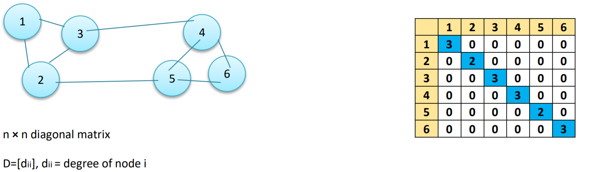 <br>

<div style="border-radius:10px; border : #682F2F solid; background-color:white; font-size:110%; padding-left:10px; text-align:left">
<h5> Spectral Clustering - Laplacian Matrix (L)</h5>

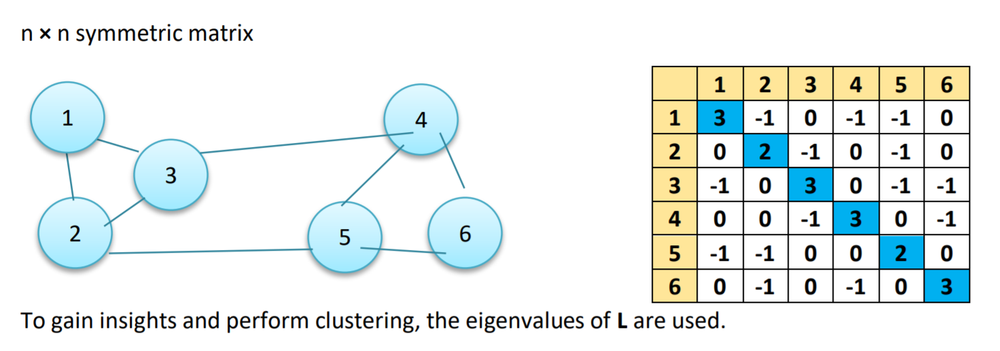 <br>
source: https://www.mygreatlearning.com/blog/introduction-to-spectral-clustering/

Graph Laplacians
The unnormalized graph Laplacian L = D – W

The normalized graph Laplacians- There are two matrices which are called normalized graph Laplacians in the literature. Both matrices are closely related to each other and are defined as Lsym := D−1/2LD−1/2 = I − D−1/2W D−1/2
Lrw := D−1L = I − D−1W.

We denote the first matrix by Lsym as it is a symmetric matrix, and the second one by Lrw as it is closely related to a random walk Eigenvectors and Eigenvalues.

We often using these terms Eigenvectors and Eigenvalues in this article, to understand more about them, For a matrix A, if there exists a vector x which isn’t all 0’s and a scalar λ such that Ax = λx, then x is said to be an eigenvector of A with corresponding eigenvalue λ.

We can think of the matrix A as a function which maps vectors to new vectors. Most vectors will end up somewhere completely different when A is applied to them, but eigenvectors only change in magnitude.

If we drew a line through the origin and the eigenvector, then after the mapping, the eigenvector would still land on the line. The amount which the vector is scaled along the line depends on λ.

Eigenvectors are an important part of linear algebra, because they help describe the dynamics of systems represented by matrices. There are numerous applications which utilize eigenvectors, and we’ll use them directly here to perform spectral clustering.

https://www.mygreatlearning.com/blog/introduction-to-spectral-clustering/

#### Testing on moon shaped data


```python
X, y = make_moons(150, noise=.07, random_state=47)
labs = DS_Spectral(X)
create_plot(X, labs, size = (6,4), title = 'Moon shaped data - Clustering using DS_Spectral Clustering')
```


    
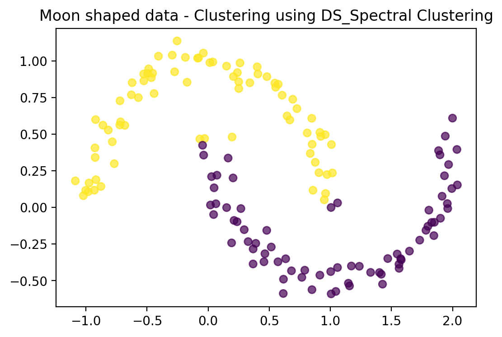
    


#### Building and training the model
- We will use the data above(concentric circles) for implementing Spectral clustering
- Utilizing the sklearn in-built class for this example

#### Testing on concentric circles shaped data


```python
X, _ = datasets.make_circles(n_samples=500, noise=0.1, factor=.2)
sc_model = SpectralClustering(n_clusters = 2, affinity ='nearest_neighbors')
labels = sc_model.fit_predict(X)
create_plot(X, labels, size = (6,4), title = 'Concentric Circles Clustering')
```

    /Users/deepaksingh/opt/anaconda3/lib/python3.9/site-packages/sklearn/manifold/_spectral_embedding.py:274: UserWarning: Graph is not fully connected, spectral embedding may not work as expected.
      warnings.warn(


    
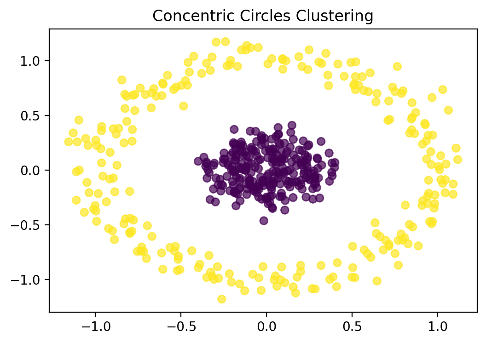
    


Comparison with Standard KMeans Clustering:
- Spectral Clustering can handle data at scale ans is very robust around non-linear data
- It reduces the dimensions of the data b efore processing for clustering
- Spectral Clustering is very robust to outliers
- Model complexity is on the higher side in case of Spectral clustering compared to Naive KMeans
- Selecting the right number of clusters is critical before processing as it might be more compute intensive

***
<a id='7'></a>

## 7) How to measure performance
- There are several ways to measure performance of the various clustering algorithms, some of which are discussed below

### Time Complexity:
(Ref: https://en.wikipedia.org/wiki/K-means_clustering)

#### Finding the optimal solution to the k-means clustering problem for observations in d dimensions is:
- NP-hard in general Euclidean space (of d dimensions) even for two clusters
- NP-hard for a general number of clusters k even in a plane
- if k and d (the dimension) are fixed, the problem can be exactly solved in time $O(n^{dk+1})$, where n is the number of entities to be clustered

Thus, a variety of heuristic algorithms such as Lloyd's algorithm given above are generally used. <br>
- The running time of Lloyd's algorithm (and most variants) is: <br>
$O(nkdi)$, where
    - n is the number of d-dimensional vectors (to be clustered)
    - k the number of clusters
    - i the number of iterations needed until convergence.

On data that does have a clustering structure, the number of iterations until convergence is often small, and results only improve slightly after the first dozen iterations. Lloyd's algorithm is therefore often considered to be of "linear" complexity in practice, although it is in the worst case superpolynomial when performed until convergence

In the worst-case, Lloyd's algorithm needs 
${\displaystyle i=2^{\Omega ({\sqrt {n}})}}$ iterations, so that the worst-case complexity of Lloyd's algorithm is superpolynomial.


```python
# WARNING: Please run this cell with the consideration that this is a time consuming process
X = datasets.load_iris().data[:,[0,1]]
iter_list = np.hstack((np.arange(1, 10, 2), np.arange(10, 100, 20), np.arange(100, 1000, 200), [1000, 5000, 10000]))
plot_complexity(X, iter_list)
```


    
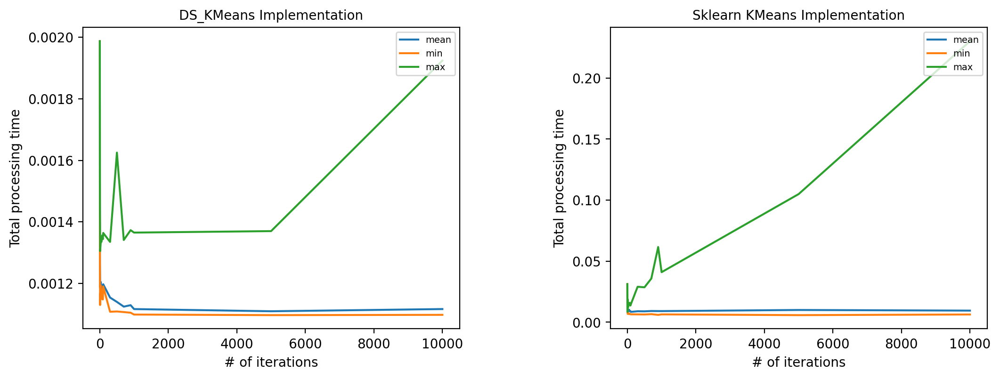
    


#### A) Speed Test Benchmarking - (My implementation, i.e. DS_KMeans vs Sklearn KMeans)


```python
X = datasets.load_iris().data[:,[0,1]]
ds, sk = benchmark(X, nitr = 100)
display(pd.concat([ds, sk], axis=0))
```


<div>
<style scoped>
    .dataframe tbody tr th:only-of-type {
        vertical-align: middle;
    }

    .dataframe tbody tr th {
        vertical-align: top;
    }

    .dataframe thead th {
        text-align: right;
    }
</style>
<table border="1" class="dataframe">
  <thead>
    <tr style="text-align: right;">
      <th></th>
      <th>count</th>
      <th>mean</th>
      <th>std</th>
      <th>min</th>
      <th>25%</th>
      <th>50%</th>
      <th>75%</th>
      <th>max</th>
    </tr>
  </thead>
  <tbody>
    <tr>
      <th>DS_KMeans</th>
      <td>100.0</td>
      <td>0.001104</td>
      <td>0.000245</td>
      <td>0.001011</td>
      <td>0.001026</td>
      <td>0.001040</td>
      <td>0.001104</td>
      <td>0.003356</td>
    </tr>
    <tr>
      <th>KMeans</th>
      <td>100.0</td>
      <td>0.030328</td>
      <td>0.004554</td>
      <td>0.024975</td>
      <td>0.027253</td>
      <td>0.028636</td>
      <td>0.031663</td>
      <td>0.046015</td>
    </tr>
  </tbody>
</table>
</div>


```python
X = np.linspace(80, 100, 578)
ds, sk = benchmark(X, nitr = 100)
display(pd.concat([ds, sk], axis=0))
```


<div>
<style scoped>
    .dataframe tbody tr th:only-of-type {
        vertical-align: middle;
    }

    .dataframe tbody tr th {
        vertical-align: top;
    }

    .dataframe thead th {
        text-align: right;
    }
</style>
<table border="1" class="dataframe">
  <thead>
    <tr style="text-align: right;">
      <th></th>
      <th>count</th>
      <th>mean</th>
      <th>std</th>
      <th>min</th>
      <th>25%</th>
      <th>50%</th>
      <th>75%</th>
      <th>max</th>
    </tr>
  </thead>
  <tbody>
    <tr>
      <th>DS_KMeans</th>
      <td>100.0</td>
      <td>0.166655</td>
      <td>0.004021</td>
      <td>0.163667</td>
      <td>0.164649</td>
      <td>0.165577</td>
      <td>0.166983</td>
      <td>0.195942</td>
    </tr>
    <tr>
      <th>KMeans</th>
      <td>100.0</td>
      <td>0.057088</td>
      <td>0.015214</td>
      <td>0.046172</td>
      <td>0.051336</td>
      <td>0.053435</td>
      <td>0.056196</td>
      <td>0.158991</td>
    </tr>
  </tbody>
</table>
</div>


### Speed Test Summary
- KMeans is relatively simple to apply compared to other clustering algorithms
- KMeans implementation is much faster in Sklearn (from a 1-D perspective)
- DS_KMeans is still faster than Scikit-learn's implementation for a small sample size of n-D data

#### B) Rand Index
- Rand Index (adjusted or unadjusted) measures similarity of the true vs predicted labels, ignoring permutations

 $RI = \frac{(a + b)}{C^{n_{samples}}_{2}} $
- where $C^{n_{samples}}_{2}$ is the toal number of possible pairs, 
- a = number of pairs of elements that are in the same set in both ground truth and the clustered outcome
- b = number of pairs of elements that are in the different sets in ground truth and the clustered outcome
- An example to calculate Rand Index is shown below


```python
true_labels = [1, 1, 1, 0, 2, 2, 0, 0, 0, 1, 1, 1]
pred_labels = [0, 0, 1, 1, 2, 2, 0, 0, 1, 1, 1, 1]
metrics.rand_score(true_labels, pred_labels), metrics.adjusted_rand_score(true_labels, pred_labels)
```


    (0.6363636363636364, 0.18181818181818182)


#### C) Mutual Information Score
- Mutual Information score measures the agreement of the two assignments i.e. ground truth vs clustered outcome, ignoring permutations
- Two versions: Normalized Mutual Information (NMI) and Adjusted Mutual Information (AMI)


```python
true_labels = [1, 1, 1, 0, 2, 2, 0, 0, 0, 1, 1, 1]
pred_labels = [0, 0, 1, 1, 2, 2, 0, 0, 1, 1, 1, 1]
metrics.adjusted_mutual_info_score(true_labels, pred_labels), metrics.normalized_mutual_info_score(true_labels, pred_labels)
```


    (0.30246548105765353, 0.4568876526410577)


#### D) Homogeneity, completeness and V-measure (Ref: scikit-learn)
- homogeneity: each cluster contains only members of a single class
- completeness: all members of a given class are assigned to the same cluster


```python
true_labels = [1, 1, 1, 0, 2, 2, 0, 0, 0, 1, 1, 1]
pred_labels = [0, 0, 1, 1, 2, 2, 0, 0, 1, 1, 1, 1]
print(metrics.homogeneity_score(true_labels, pred_labels), 
      metrics.completeness_score(true_labels, pred_labels), metrics.v_measure_score(true_labels, pred_labels))
```

    0.4568876526410577 0.4568876526410577 0.4568876526410577


***
<a id='8'></a>

## 8) Reference

#### Initializing code


```python
from ds_kmeans import *
%config InlineBackend.figure_format = 'retina'
```

#### References used from the internet
- https://github.com/parrt/msds689/blob/master/projects/kmeans/kmeans.md
- https://scikit-learn.org/stable/modules/clustering.html
- https://scikit-learn.org/stable/modules/generated/sklearn.cluster.SpectralClustering.html#sklearn.cluster.SpectralClustering
- https://people.csail.mit.edu/dsontag/courses/ml14/notes/Luxburg07_tutorial_spectral_clustering.pdf
- https://medium.com
- https://stackoverflow.com
- https://wikipedia.com

#### Following functions have been implemented in ds_kmeans.py:
- `DS_Kmeans()` # Naive KMeans algorithm
- `select_centroids()` # Centroid initialization for Kmeans++ algorithm
- `DS_Spectral(X)` # Spectral Clustering
- `conmat_metrics()` # for generating the comfusion metrics for classification
- `calculate_WSS()` # for calculating within cluster SSE for finding the optimum number of clusters using the elbow method
- `calculate_sil()` # for calculating the silhouette score for finding the optimum number of clusters using the silhouette score method
- `func_test() and benchmark()` # these are to perform the speed benchmark test of two clustering algorithms
- `create_plot()` # to enable creation of plots with kmeans clustering outputs in a single line on this report
- `gen_data()` # this is to generate random data from various algorithms in sklearn for testing

#### Following key packages were used in creating this report
- pandas
- numpy
- math
- scipy
- matplotlib
- sklearn
- scipy
- datetime

***
<a id='9'></a>

## 9) Code Base

<details>
<summary>Packages</summary>
<pre>
import pandas as pd
import numpy as np
import scipy
import math
import imageio.v2 as imageio
import matplotlib as mpl
import matplotlib.pyplot as plt
import matplotlib.colors as mcolors
import matplotlib.animation as anim
from matplotlib.patches import Rectangle
from sklearn import datasets
from sklearn import metrics
from sklearn.datasets import make_blobs, make_moons
from sklearn.cluster import KMeans
from skimage.color import rgb2gray
from skimage import img_as_ubyte,img_as_float
#from sklearn.cluster import SpectralClustering
from sklearn.preprocessing import StandardScaler, normalize
from sklearn.decomposition import PCA
from sklearn.metrics import silhouette_score
from sklearn.neighbors import radius_neighbors_graph
from sklearn.neighbors import kneighbors_graph
from scipy.sparse import csgraph
from tqdm import tqdm
import datetime as dt
from PIL import Image
from skimage import data
</pre>
</details>

<details>
<summary>DS_KMeans</summary>
<pre>
def DS_KMeans(X:np.ndarray, k:int, random_state = 47, init='random', max_iter=300, tolerance=1e-2):
    """
    X = input data in the form of numpy array
    k = number of clusters
    random_state = random state seed to be used in numpy.random operations
    init = {'random', 'k-means++'} where 'k-means++' will try to initiate the centroids at reasonable distances apart
    max_iter = number of iterations to converge at the best estimate of centroids
    tolerance = the difference in previous and current centroids (converge if this limit is met)
    """
    np.random.seed(random_state)
    
    # handling 1-D vs n-D inputs in X
    lxy = len(X.shape)
    if lxy == 1:
        shp1 = 1
        ax = None
    else:
        shp1 = X.shape[1]
        ax = 0
    
    # checking if initial centroid is provided
    if init == 'random':
        idx = np.random.choice(np.arange(X.shape[0]), size=k, replace = False)
        cents = X[idx]
    elif init == 'k-means++':
        cents = select_centroids(X, k)

    # initializing iterator and diff in previous and new centroids
    niter = 0
    diff = 1
    labels = []
    
    # main iteration on max_iter and tolerance level
    while niter < max_iter and diff >= tolerance:
        labels = []
        # calculating distances of each point from each cluster (centroid)
        if lxy == 1:
            for x in X:
                dist = []
                for c in cents:
                    dist.append(np.sqrt(np.sum((x-c)**2)))
                labels.append(dist.index(min(dist)))
        else:
            dist = scipy.spatial.distance.cdist(X,cents)
            labels = np.argmin(dist, axis = 1)

        # initializing the new centroid
        dcent ={}
        
        # calculating the new centroid
        for i in np.unique(labels):
            tmp = X[np.where(labels == i)]
            dcent[i] = np.mean(tmp, axis = 0)
        n_cents = np.array(list(dcent.values()))
        
        # calculating the diff in previous and new centroids
        diff = np.mean(np.linalg.norm(n_cents - cents))
        cents = n_cents.copy()
        
        # looping
        niter += 1
    return np.round(n_cents,3), labels
</pre>
</details>

<details>
<summary>Select_Centroids for KMeans++</summary>
<pre>
def select_centroids(X,k = 3, random_state = 47):
    """
    kmeans++ algorithm to select initial points:

    1. Pick first point randomly
    2. Pick next k-1 points by selecting points that maximize the minimum
       distance to all existing clusters. So for each point, compute distance
       to each cluster and find that minimum.  Among the min distances to a cluster
       for each point, find the max distance. The associated point is the new centroid.

    Return centroids as k x p array of points from X.
    """
    # random start point for centroids
    np.random.seed(random_state)
    lxy = len(X.shape)
    if lxy == 1:
        shp1 = 1
        ax = None
    else:
        shp1 = X.shape[1]
        ax = 1
    idx = np.random.choice(np.arange(X.shape[0]), size=1, replace = False)
    centroids = X[idx]
    
    for p in range(k-1):
        mxd = {}
        dist = []
        for i,c in enumerate(centroids):
            if lxy == 1:
                dist = np.linalg.norm(X - c, ord = None, axis = ax)
            else:
                dist = scipy.spatial.distance.cdist(X,[c])
            n_idx = np.where(dist == max(dist))[0][0]
            if n_idx not in mxd:
                mxd[n_idx]= max(dist)
            elif max(dist) > mxd[n_idx]:
                mxd[n_idx]= max(dist)
        idx_n_cent = list(mxd.keys())[list(mxd.values()).index(max(mxd.values()))]
        if (centroids == X[idx_n_cent]).all(axis = 1).any():
            centroids = np.append(centroids, [X[idx_n_cent-p]], axis = 0)
        else:
            centroids = np.append(centroids, [X[idx_n_cent]], axis = 0)
    return centroids
</pre>
</details>

<details>
<summary>DS_Spectral Clustering</summary>
<pre>
def DS_Spectral(X):
    Xa = radius_neighbors_graph(X,radius = 0.5, mode='distance', metric='minkowski', p=2, metric_params=None, include_self=False)
    Xa = Xa.toarray()

    Lapl = csgraph.laplacian(Xa, normed=False)

    eigval, eigvec = np.linalg.eig(Lapl)
    labs =eigvec[:,2].copy()
    labs[labs < 0] = 0
    labs[labs > 0] = 1
    labs = labs.astype(int)
    return labs
</pre>
</details>

<details>
<summary>Calculate_WSSE</summary>
<pre>
def calculate_WSS(X, kmax, size = (6, 4)):
    '''
    function to calcualte within cluster SSE
    '''
    wsse = {'k':[], 'wsse':[]}
    for k in range(1, kmax+1):
        # kmeans = KMeans(n_clusters = k, n_init = 'auto').fit(X)
        # y_pred, centroids = kmeans.predict(X), kmeans.cluster_centers_
        centroids, y_pred = DS_KMeans(X, k = k)
        n_sse = 0
        # calculate square of distances
        for i in range(len(X)):
            n_center = centroids[y_pred[i]]
            n_sse += (X[i, 0] - n_center[0]) ** 2 + (X[i, 1] - n_center[1]) ** 2
        wsse['k'].append(k)
        wsse['wsse'].append(n_sse)
    fig,ax = plt.subplots(nrows=1, ncols=1, figsize=size)
    # ax.plot(wsse['wsse'])
    pd.DataFrame(wsse).plot(y = 'wsse', ax = ax)
    ax.set_xticks(np.arange(0,k+1))
    ax.set_xticklabels(np.arange(1,k+2))
    ax.set_xlabel('k')
    plt.show()
    return pd.DataFrame(wsse)
</pre>
</details>

<details>
<summary>Calculate_SIL</summary>
<pre>
def calculate_sil(X, kmax, size = (6, 4)):
    '''
    Function to calculate silouette score
    '''
    sil = {'k':[], 'sil':[]}
    for k in range(2, kmax+1):
        # kmeans = KMeans(n_clusters = k, n_init = 'auto').fit(X)
        # y_pred, centroids = kmeans.predict(X), kmeans.cluster_centers_
        centroids, y_pred = DS_KMeans(X, k = k)
        n_sil = silhouette_score(X, y_pred, metric = 'euclidean')
        sil['k'].append(k)
        sil['sil'].append(n_sil)
    fig,ax = plt.subplots(nrows=1, ncols=1, figsize=size)
    pd.DataFrame(sil).plot(y = 'sil', ax = ax)
    ax.set_xticks(np.arange(0,k+1))
    ax.set_xticklabels(np.arange(1,k+2))
    ax.set_xlabel('k')
    plt.show()
    return pd.DataFrame(sil)
</pre>
</details>

<details>
<summary>Test_Run_Function</summary>
<pre>
def func_test(func, itrange, X, k = 3, init = 'random'):
    """
    func = {DS_KMeans, KMeans} # requires sklearn
    itrange = iterations to calculate speed on
    X = data source in 1-D or 2-D
    init = {'random', 'k-means++'}
    """
    d_timer = {'start': [], 'end': [], 'total': []}
    for i in range(itrange):
        st = dt.datetime.now()
        d_timer['start'].append(st)
        if func == KMeans:
            if len(X.shape)==1:
                X = X.reshape(-1, 1)
            kmeans = KMeans(n_clusters=k, init=init, random_state = 47, max_iter=300, n_init='auto').fit(X)
            y_pred = kmeans.predict(X)
            centroids  = kmeans.cluster_centers_
        else:
            func(X=X, k=k, init=init, random_state=47, max_iter=300)
        et = dt.datetime.now()
        d_timer['end'].append(et)
        d_timer['total'].append(et.timestamp()-st.timestamp())
    df_res = pd.DataFrame(d_timer['total'])
    df_speed = pd.DataFrame(d_timer['total']).describe(include = 'all').T.set_index([pd.Index([str(func.__name__)])])
    return df_speed, df_res
</pre>
</details>

<details>
<summary>Plot_Complexity</summary>
<pre>
def plot_complexity(X, iter_list = np.arange(1, 1000, 100), p_init = 'random'):
    
    ds, sk = pd.DataFrame(), pd.DataFrame()
    
    for i in range(len(iter_list)):
        ds1, sk1 = benchmark(X, iter_list[i])
        ds = pd.concat([ds, ds1], axis=0)
        sk = pd.concat([sk, sk1], axis=0)
    # ymax, ymin = 100, 0
    fig, ax = plt.subplots(nrows=1, ncols=2, figsize=(12,4))
    # ax[0].plot(ds['count'], ds['total'])
    ax[0].plot(ds['count'], ds['mean'], label = 'mean')
    ax[0].plot(ds['count'], ds['min'], label = 'min')
    ax[0].plot(ds['count'], ds['max'], label = 'max')
    ax[0].set_title('DS_KMeans Implementation', fontsize = 10)
    ax[0].set_xlabel('# of iterations')
    ax[0].set_ylabel('Total processing time')
    # ax[0].set_ylim(ymin, ymax)
    # ax[1].plot(sk['count'], sk['total'])
    ax[1].plot(sk['count'], sk['mean'], label = 'mean')
    ax[1].plot(sk['count'], sk['min'], label = 'min')
    ax[1].plot(sk['count'], sk['max'], label = 'max')
    ax[1].set_title('Sklearn KMeans Implementation', fontsize = 10)
    ax[1].set_xlabel('# of iterations')
    ax[1].set_ylabel('Total processing time')
    # ax[1].set_ylim(ymin, ymax)
    plt.subplots_adjust(left=0.1,bottom=0.1,right=0.9,top=0.9,wspace=0.4,hspace=0.4)
    ax[0].legend(loc = 1, fontsize = 7)
    ax[1].legend(loc = 1, fontsize = 7)
    plt.show()
</pre>
</details>

<details>
<summary>Confusion Matrix</summary>
<pre>
def conmat(hp, ground_truth):
    true_pos, true_neg, false_pos, false_neg = 0, 0, 0, 0

    for i in range(len(hp)):
        if hp[i] == ground_truth[i] and hp[i] == 1:
            true_pos += 1
        elif hp[i] == ground_truth[i] and hp[i] == 0:
            true_neg += 1
        elif hp[i] != ground_truth[i] and hp[i] == 1:
            false_pos += 1
        elif hp[i] != ground_truth[i] and hp[i] == 0:
            false_neg += 1
    
    return true_pos, false_neg, false_pos, true_neg

def conmat_metrics(true_pos, false_neg, false_pos, true_neg):
    total = true_pos + false_neg + false_pos + true_neg
    precision = true_pos / (true_pos + false_pos)
    recall = true_pos / (true_pos + false_neg)
    fpr = false_pos / (false_pos + true_neg)
    acc = (true_pos + true_neg) / total
    return round(precision, 4), round(recall, 4), round(fpr, 4), round(acc, 4)
</pre>
</details>

<details>
<summary>Speed Test Benchmark</summary>
<pre>
def benchmark(X, nitr):
    ds = func_test(func = DS_KMeans, itrange = nitr, X=X, init = 'random')[0]
    sk = func_test(func = KMeans, itrange = nitr, X=X, init = 'random')[0]
    ds['total'] = np.sum(ds['count'] * ds['mean'])
    sk['total'] = np.sum(sk['count'] * sk['mean'])
    return ds, sk
</pre>
</details>

***
